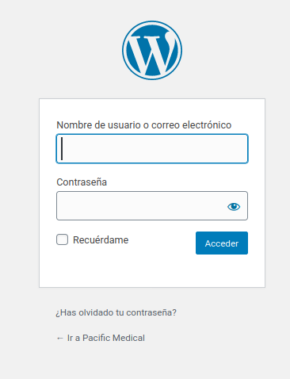
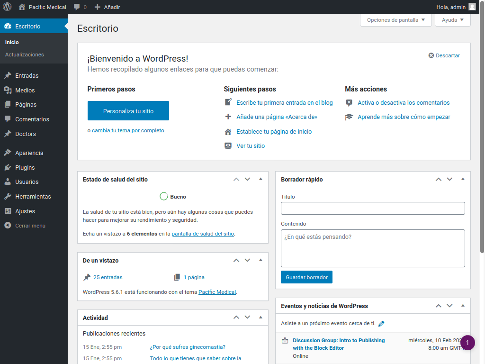
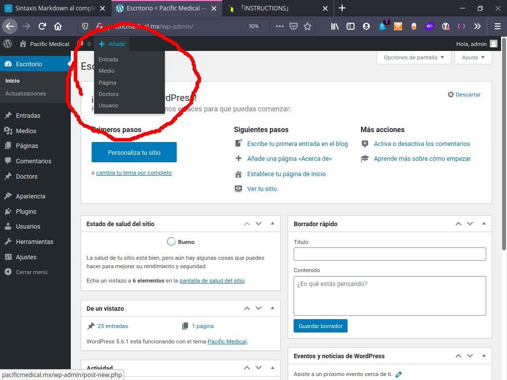
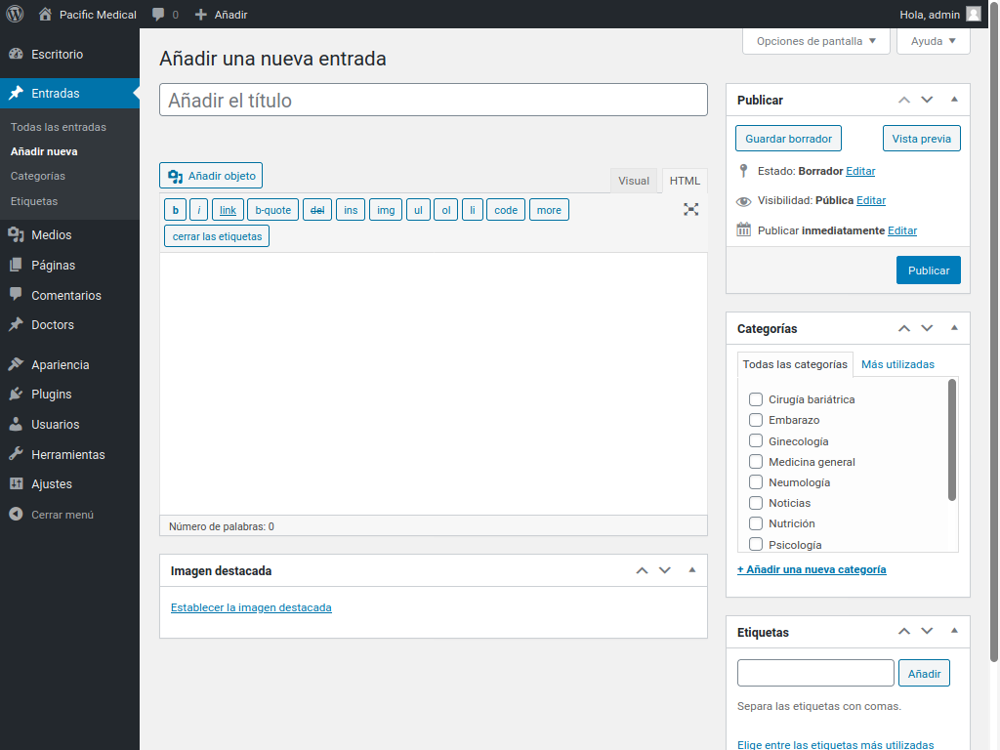
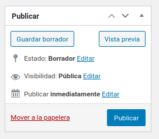
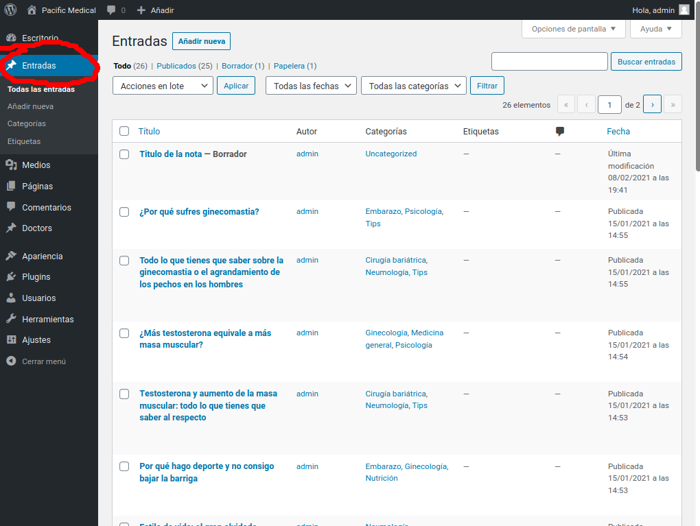
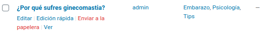
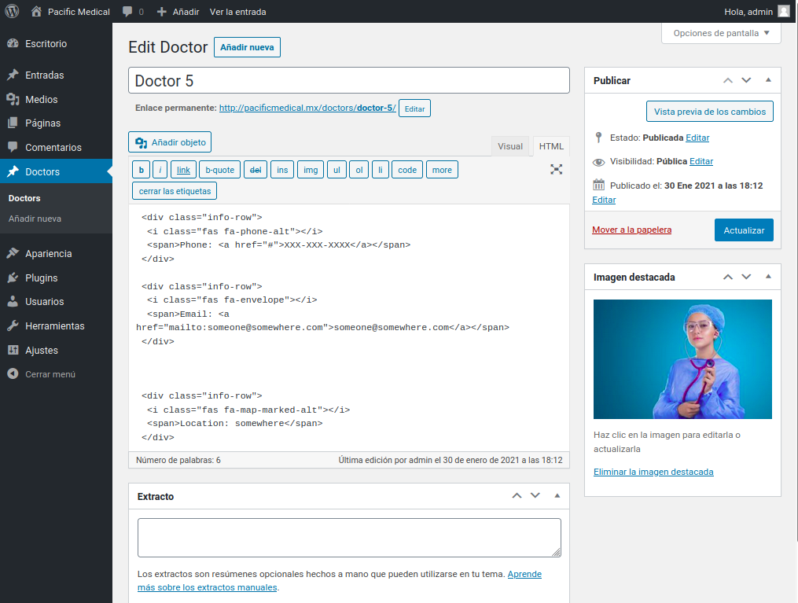
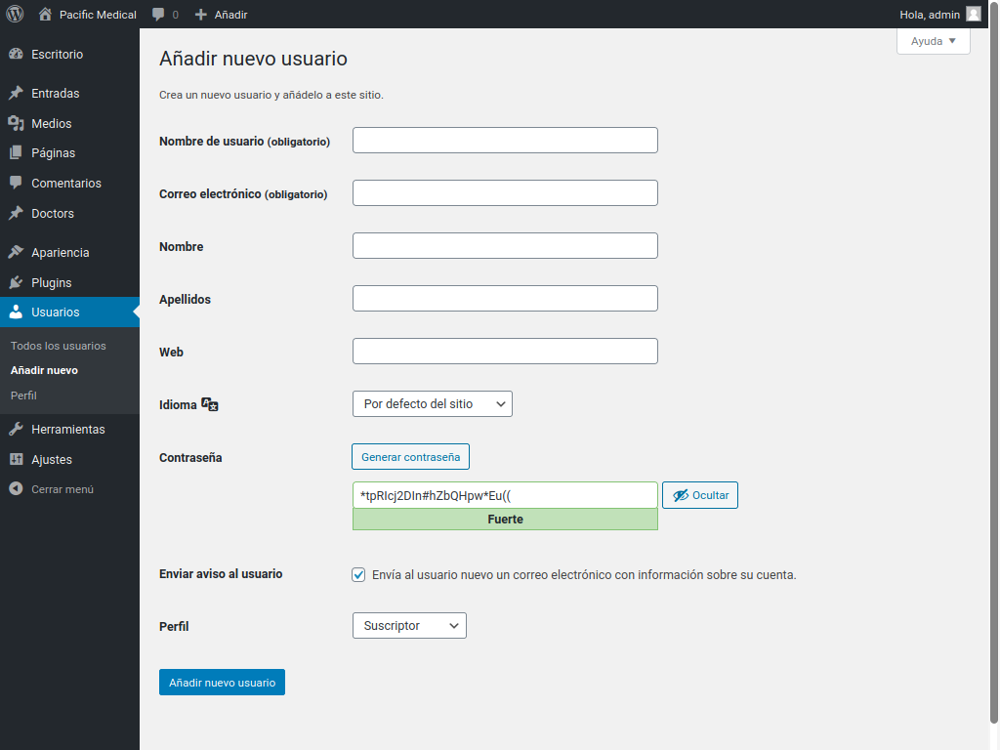

# Pacific Medical, Manual de Instrucciones

## Ingresar a wordpress

Para ingresar al sistema de wordpress es necesario contar con un usuario registrado en el sistema.

1. Si ya se cuenta con un usuario registrado ingresar a la siguiente [url](http://pacificmedical.mx/wp-admin/)

   

2. Se debe proporcionar un usuario y una contraseña valida para poder acceder.

3. Una vez dentro del sistema el sistema nos redigira automaticamente a la siguiente pantalla:

   

   La barra lateral izquierda lista todas las acciones o herramientas con las que cuenta cada usuario, por lo cual
   esta seccion puede verse diferente.

## Crear una nueva nota

Para crear una nueva nota podemos hacerlo directamente desde el simbolo "+" que se encuentra en la parte superior de la pantalla,
posicionando el mouse sobre el desplegara el menu descentente mostrado a continuacion:



Seleccionamos entrada y seremos redirigidos a la siguiente pantalla:



Dentro de esta pantalla nosotros podemos:

1. Agregar un titulo
2. Agregar contenido
3. Agregar una o mas categorias
4. Agregar una o mas etiquetas
5. Agregar una imagen destacada

## Guardar una nota



Si el contenido escrito en la entrada es correcto y queremos que sea publicado seleccionamos en publicar.

NOTA: Una vez creada la nota el boton de publicar sera reemplazado por actualizar, que nos permite corregir cualquier aspecto de la nota aunque esta ya halla sido publicada.

Tambien podemos guardar la nota como un borrador, en este caso la nota no es mostrada publicamente, pero se archiva para su publicacion posterior

Contamos ademas con tres opciones que son:

    1. Estado:: Muestra el estado en el que se encuentra actualmente la nota

    2. Visibilidad:: Permite configurar medidas de privacidad, si no queremos
    que la nota sea visible para cualquier persona por ejemplo.

    3. Publicar: Esto nos da la opcion de programar una fecha y hora especificas
    para que la nota sea publicada.

Cualquiera de estas opciones puede ser modificada seleccionando la parabra "Editar", que se
encuentra al final de cada opcion.

## Administrar notas



Seleccionar el menu Entradas que se encuentra en la barra de navegacion nos redigira a el archivo de notas, en el que se encuentran todas las notas,
tanto las que se encuentran publicadas como las que estan en borrador.

Posicionar el mouse sobre una entrada desplegara el menu de opciones de la nota.


Desde este menu podemos eliminar(Enviar a la papelera), editar y ver la nota.

## Agregar doctor a directorio

Al igual que las notas existe un apartado especial para la seccion de doctores, la cual se maneja de la misma manera que en el caso de las notas,
para agregar a un doctor se posiciona el mouse sobre el simbolo "+" que se encuentra
en la barra superior y seleccionamos Doctors.

Nota: Por cuestiones de facilitar la lectura del codigo fuente, aparecera como Doctors en lugar de Doctores, esto no afecta el idioma en el que debe colocarse la nota en ninguna manera.


Una vez seleccionada esta opcion seremos redirigidos a la siguiente ventana:


La cual es parecida a la de notas, solamente que sin las opciones de categorias y etiquetas.
Es necesario ingresar el contenido de la manera en la que se encuentra en la imagen anterior, a continuacion se presenta un borrador
al que unicamente sera necesario pegar los datos del Doctor en cuestion.

```
 <div class="info-row">
  <i class="fas fa-phone-alt"></i>
  <span>Phone: <a href="tel:(Numero de teleforno)">(Numero de telefono)</a></span>
 </div>

 <div class="info-row">
  <i class="fas fa-envelope"></i>
  <span>Email: <a href="mailto:"(Correo Electronico)">(Correo Electronico)</a></span>
 </div>


 <div class="info-row">
  <i class="fas fa-map-marked-alt"></i>
  <span>Direccion:<a href="(Link de google maps)">(Direccion)</a> <span>
 </div>
```

Es necesario cambiar unicamente los campos: 1. (Numero de telefono), aparece 2 veces 2. (Correo electronico), aparece 2 veces 3. (Link de google maps), aparece 1 vez 4. (Direccion), aparece 1 vez

Nota: El nombre del doctor es colocado en la seccion de Titulo

Por ejemplo, si los datos del Doctor Juan Perez son los siguientes: 1. Telefono - 641-259-2938 2. Correo Electronico - doctorjuanito@perez.com 3. Direccion - Calle 1ra #1234

El codigo que debemos copiar dentro del contenido del doctor sera el siguiente:

```
<div class="info-row">
  <i class="fas fa-phone-alt"></i>
  <span>Phone: <a href="tel: 641-259-2938">641-259-2938</a></span>
 </div>

 <div class="info-row">
  <i class="fas fa-envelope"></i>
  <span>Email: <a href="mailto: doctorjuanito@perez.com">doctorjuanito@perez.com</a></span>
 </div>


 <div class="info-row">
  <i class="fas fa-map-marked-alt"></i>
  <span>Direccion:<a href="https://maps.google.com/*"></a>Calle 1ra #1234 <span>
 </div>
```

El proceso de guardado y edicion de el archivo de doctores es igual al de Entradas visto anteriormente.

## Gestionar Usuarios

El sistema de gestion de usuarios permite a la cuenta de administrador
ingresar nuevos usuarios y otorgar diferentes permisos a ellos, esto es recomendable ya que el
cuenta con todos los permisos dentro del sistema, por lo que le es posible borrar o modificar archivos
que pueden provocar un mal funcionamiento del sistema, entrar y modificar las bases de datos, etc.
es por esto tambien que no es recomendable otorgar
los accesos de administrador a alguna persona que no sea de total confianza.

Para crear un nuevo usuario nuevamente nos dirigimos al signo '+' que se encuentra en la parte superior del
sistema y seleccionamos Usuario


Esto nos redireccionara a la siguienta pantalla:



Los unicos campos que son necesarios para registrar a un nuevo usuario son: 1. Nombre de usuario
Nota: El nombre de usuario no acepta caracteres especiales, esto
incluye el acento, por lo cual si se quiere agregar sera necesario
hacerlo en el campo de Nombre, de lo contrario el sistema
mandara una alerta y no creara el usuario. 2. Correo Electronico

    3. Contrasena
    	Nota: El sistema genera una contraseña segura por defecto, es posible
    	modificarla y utilizar una contraseña personalizada.

    4. Perfil
    	 Esto indica los permisos con los que contara el usuario, los cuales
    	 pueden ser:

    	 1. Suscriptor
    		Usuario con permiso de lectura unicamente, si bien no tiene
    		utilidad inmediata la lista de usuarios Subscriptor permite
    		gestionar difusion de contenido, como listas de correo
    		electronico por ejemplo.
    	 2. Colaborador
    		Le es posible escribir articulos pero no cuenta con permiso
    		para publicarlos, para esto dichos articulos deben ser aprobados
    		por un usuario de categoria mayor.
    	 3. Autor
    		Puede escribir notas, publicarlas y editarlas
    		Nota: este usuario a diferencia del editor no cuenta con
    		permisos para modificar notas que no sean de su autoria.
    	 4. Editor
    		Cuenta con todos los permisos del autor mas la posibilidad
    		de modificar contenido de cualquier otro usuario a exepcion
    		del administrador.
    	 5. Administrador
    		Cuenta maestra, cuenta con todos los permisos
    		de creacion y edicion.


Nota: Los usuarios se encuentran listados descendentemente en orden
de permisos, esto quiere decir que cada usuario tiene control
sobre otro usuario cuyo permiso sea inferios, siendo el
Subscriptor el usuario con menos permisos y el Administrador la
cuenta maestra.
Nota: Es posible tener mas de un usuario administrador, sin embargo
se vuelve a reiterar que no es recomendable utilizar la cuenta de
usuario de manera cotidiana a menos de que realmente se sepa lo que
se esta haciendo.
